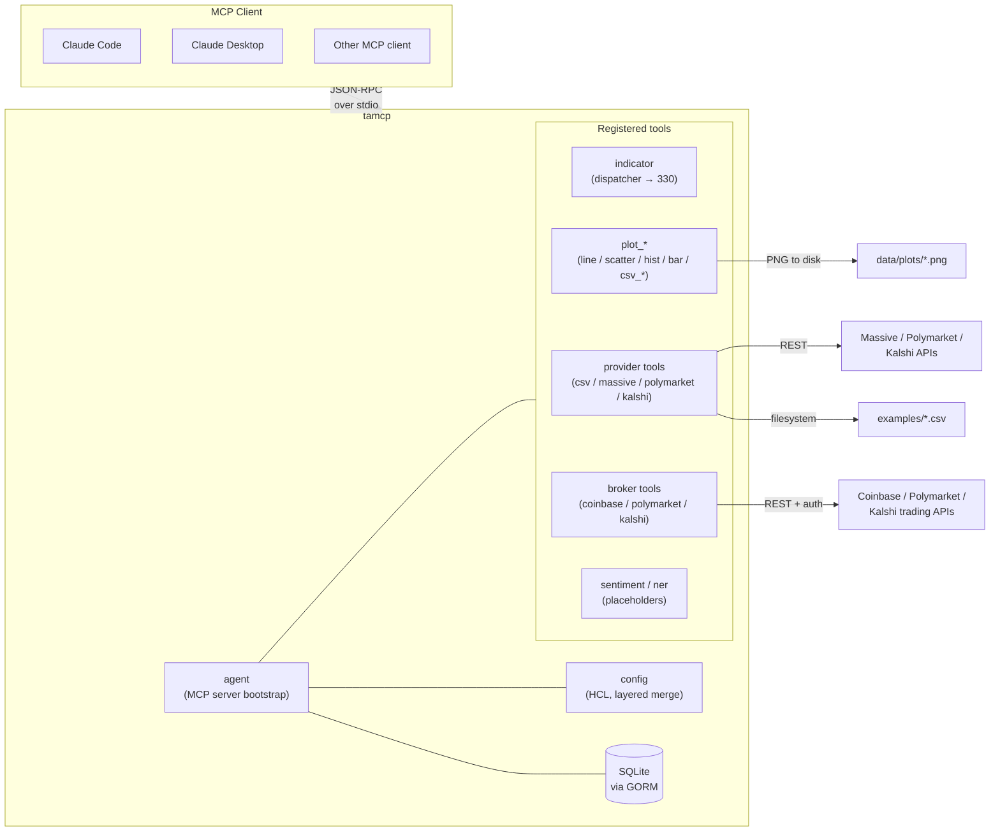
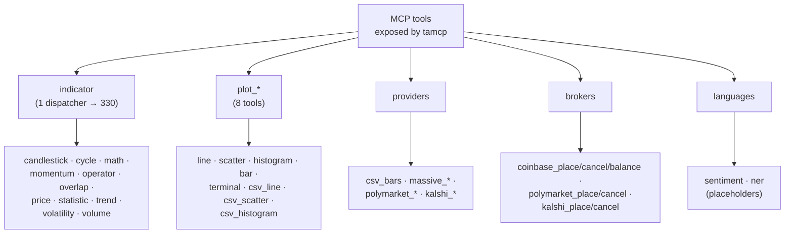

# tamcp

**Technical-Analysis Model Context Protocol server** — 330 indicators, charts, market-data and broker tools, exposed over MCP for Claude Code, Claude Desktop, or any MCP-compatible client.

Speaks JSON-RPC over stdio per the [Model Context Protocol](https://modelcontextprotocol.io). Written in Go, single binary, HCL configuration, optional SQLite persistence.

- **330 indicators** behind a single `indicator` dispatcher tool (full TA-Lib v0.4 surface plus a community set)
- **Plot tools** — line, scatter, histogram, bar, terminal sparkline, plus CSV-sourced variants
- **Data providers** — local CSV, Massive, Polymarket, Kalshi
- **Broker stubs** — Coinbase, Polymarket, Kalshi (disabled by default)
- **NLP placeholders** — sentiment, NER

**Docs:** [tamcp.github.io site](https://rangertaha.github.io/tamcp/) · [Architecture & diagrams](docs/architecture.md) · [Full indicator catalog (330)](docs/indicators.md) · [Changelog](CHANGELOG.md)

## Architecture



See [`docs/architecture.md`](docs/architecture.md) for deeper diagrams (config merge, indicator dispatch, registration flow).

## Contents

- [Quickstart](#quickstart)
- [CLI](#cli)
- [Configuration](#configuration)
- [Tools](#tools)
  - [`indicator` dispatcher](#indicator--dispatcher)
  - [Plot tools](#plot-tools)
  - [Data providers](#data-providers)
  - [Broker tools](#broker-tools)
  - [NLP](#nlp)
- [Project layout](#project-layout)
- [Adding an indicator](#adding-an-indicator)
- [Library inspirations](#library-inspirations)

## Quickstart

```sh
git clone https://github.com/rangertaha/tamcp
cd tamcp
make build                                  # → ./bin/tamcp
./bin/tamcp --config ./config.hcl server    # starts the MCP server on stdio
```

Register with Claude Code:

```sh
claude mcp add tamcp /absolute/path/to/bin/tamcp server
```

Then from Claude Code, ask "compute RSI(14) on these closes: …" and Claude will call the `indicator` tool. Discover the catalog with `{"name": "help"}` or a single indicator's argument schema with `{"name": "help:rsi"}`.

## CLI

```
tamcp [--config PATH] [--level LEVEL] [--debug] <command>
```

| Command | Purpose |
|---|---|
| `server` | Run the MCP server over stdio |
| `init [--global\|--user\|--service\|--all]` | Write config files (and on Linux, a systemd unit) |
| `init --clean [...]` | Remove files created by `init` |
| `version` | Print version, commit, build date, Go version |
| `service install\|uninstall\|start\|stop` | Windows Service Control Manager integration |

`tamcp init` with no flags writes everything: global config (`/etc/tamcp/config.hcl`), user config (`~/.config/tamcp/config.hcl`), and a systemd unit (`/etc/systemd/system/tamcp.service`).

## Configuration

HCL files are loaded and merged in this order — later layers override earlier ones:

1. **Embedded defaults** (`internal/config/config.hcl`)
2. **Global** — `/etc/tamcp/config.hcl`
3. **User** — `~/.config/tamcp/config.hcl`
4. **Project** — passed via `-c <path>` (e.g. `./config.hcl`)

Stdout is reserved for MCP framing, so logs go to stderr or a file — never stdout.

```hcl
debug   = true
datadir = "./data"

logging {
  level = "debug"
  file  = ""    # empty → stderr (stdout is reserved for MCP)
}

server {
  name      = "tamcp"
  transport = "stdio"
}

database {
  driver = "sqlite"
  dsn    = "./data/tamcp.db"
}

# Charting (gonum/plot). Outputs PNGs to output_dir.
# auto_open pops the saved PNG in the OS default image viewer
# after each plot tool call. Set false on headless servers.
tool "plots" {
  enabled    = true
  output_dir = "./data/plots"
  width      = 800
  height     = 480
  dpi        = 96
  auto_open  = true
}

provider "csv" {
  enabled     = true
  prices_path = "./examples/prices.csv"
  orders_path = "./examples/orders.csv"
}

# provider/broker blocks for massive, polymarket, kalshi, coinbase are
# disabled until you supply credentials — see config.hcl for the full surface.
```

## Tools

Each tool is a separate MCP tool, except indicators which are collapsed behind one dispatcher to keep the model's tool list small (which improves selection accuracy and reduces token overhead).



### `indicator` — dispatcher

330 indicators behind one tool. Call shape:

```json
{ "name": "rsi", "args": { "values": [44.34, 44.09, ...], "period": 14 } }
```

Discovery:

- `{"name": "help"}` — list every supported indicator with group and description
- `{"name": "help:<name>"}` — argument schema for one indicator

Unknown names get a fuzzy "did you mean" hint listing the closest matches.

**The full 330-indicator catalog (with group, description, and parameters) is in [`docs/indicators.md`](docs/indicators.md).** Regenerate it with `make indicators-md`.

Quick group breakdown:

| Group | Count | Examples |
|---|--:|---|
| momentum | 88 | `rsi`, `macd`, `stoch`, `cci`, `kdj`, `wt`, `tdi`, `qqe`, `fisher`, `tsi`, `stc`, `smi` |
| candlestick | 61 | `cdldoji`, `cdlhammer`, `cdlengulfing`, `cdlmorningstar`, `cdl3blackcrows` |
| overlap | 47 | `sma`, `ema`, `bbands`, `supertrend`, `ichimoku`, `frama`, `vidya`, `hwma`, `mcginley`, `alma` |
| volume | 34 | `obv`, `ad`, `cmf`, `mfi`, `vwap`, `vwap_anchored`, `kvo`, `efi`, `eom`, `pvi`, `nvi` |
| statistic | 24 | `stddev`, `variance`, `linearreg`, `correl`, `beta`, `zscore`, `kurtosis`, `skew` |
| volatility | 24 | `atr`, `natr`, `kc`/`kcb`, `donchian`, `bbw`, `squeeze`/`squeeze_pro`, `ulcer`, `chandexit` |
| math | 15 | `sin`, `cos`, `tan`, `sqrt`, `log10`, `ceil`, `floor`, `exp` |
| operator | 11 | `add`, `sub`, `mult`, `div`, `min`, `max`, `sum`, `minmax` |
| price | 10 | `avgprice`, `medprice`, `typprice`, `wclprice`, `hlc3`, `ohlc4`, `heikinashi` |
| trend | 9 | `pivot_cpr`, `camarilla`, `woodie`, `fib_pivots`, `demark_pivots`, `aroon`, `aroonosc` |
| cycle | 7 | `ssf`, `gaussian`, `cyber_cycle`, `decycler`, `reflex`, `trendflex`, `htdcperiod` |

Composition: **162 TA-Lib v0.4 functions** + **168 community indicators** sourced from Pandas TA, sdcoffey/techan, cinar/indicator, Ta-Lib-Rust, and Yatala.

### Plot tools

Each plot writes a PNG to `data/plots/` (configurable via `tool "plots" { output_dir = … }`) and returns its path plus a base64 inline copy. When `auto_open = true` (the default), the saved PNG is also opened in the OS default image viewer (`xdg-open` / `open` / `rundll32`). Set it to `false` on headless servers.

| Tool | Input shape | Notes |
|---|---|---|
| `plot_line` | `series[]` of `{name, y[], x?[]}` | Multi-series line chart |
| `plot_scatter` | same | XY scatter |
| `plot_histogram` | `values[]`, `bins?` | Frequency distribution |
| `plot_bar` | `labels[]`, `values[]` | Vertical bar chart |
| `plot_terminal` | `series[]` | ANSI / Unicode sparkline (text only, no PNG) |
| `plot_csv_line` | `path`, `y_cols[]`, `symbol?`, `x_col?` | Reads a CSV, plots columns directly |
| `plot_csv_scatter` | same | XY scatter from CSV |
| `plot_csv_histogram` | `path`, `column`, `symbol?`, `bins?` | Histogram from one CSV column |

### Data providers

| Tool | Source | Description |
|---|---|---|
| `csv_bars` | local CSV | OHLCV columns from the configured `provider "csv" { prices_path = … }` |
| `massive_bars` / `massive_quote` / `massive_tickers` | Massive REST | Bars / latest quote / ticker list |
| `polymarket_markets` / `polymarket_market` | Polymarket Gamma | Prediction-market data |
| `kalshi_markets` / `kalshi_events` | Kalshi | Prediction-market data |

The `csv` provider ships with sample data in `examples/` (`prices.csv`, `orders.csv`, `pivot.csv`, `tickers.csv`) so you can exercise the indicator and plot tools without external credentials.

### Broker tools

Disabled by default. Enable per-broker in `config.hcl` after supplying credentials.

| Tool | Operations |
|---|---|
| `coinbase_place_order` / `coinbase_cancel_order` / `coinbase_balance` | Place, cancel, query balances |
| `polymarket_place_order` / `polymarket_cancel_order` | Place, cancel |
| `kalshi_place_order` / `kalshi_cancel_order` | Place, cancel |

### NLP

`sentiment`, `ner` — placeholders pending a model-backed implementation. Both accept `{ "text": "…" }` and currently return a deterministic stub.

## Project layout

```
cmd/tamcp/                 CLI entry point
cmd/_dumpindicators/       Maintenance: writes docs/indicators.md (skipped by go build)
internal/
  agent/                   MCP server bootstrap and lifecycle
  config/                  HCL config loader, layered merge, init/clean helpers
  db/                      SQLite via GORM
  prompts/                 System prompts attached at startup
  tools/                   MCP tool plugins
    indicator/             "indicator" dispatcher tool
    indicators/            One package per indicator (registers with talib dispatcher)
      talib/               Math implementations + dispatcher registry
      all/                 Side-effect imports of every indicator subpackage
    plots/                 Plot tools (line, scatter, histogram, bar, terminal, csv_*)
    providers/             csv, massive, polymarket, kalshi
    brokers/               coinbase, polymarket, kalshi
    languages/             sentiment, ner
  winservice/              Windows Service Control Manager integration
docs/                      Architecture and indicator catalog (Mermaid diagrams)
examples/                  Sample data (prices.csv, orders.csv, pivot.csv, tickers.csv)
config.hcl                 Local development config
```

## Adding an indicator

1. Add the math function in `internal/tools/indicators/talib/` (or extend `community.go`).
2. Create `internal/tools/indicators/<name>/tool.go` with an `init()` that calls `talib.RegisterEntry(...)`. Use the helpers in `talib/runners.go` for common signatures:
   - `RunRealOnly` / `RunRealPeriod` — `values[]` (+ `period`)
   - `RunHL` / `RunHLPeriod` — `high[]`, `low[]` (+ `period`)
   - `RunHLC` / `RunHLCPeriod` — `high[]`, `low[]`, `close[]` (+ `period`)
   - `RunHLCV` / `RunHLCVPeriod` — adds `volume[]`
   - `RunOHLC` / `RunPattern` — full bar series (patterns return `int[]`)
   - `RunTwoReal` / `RunTwoRealPeriod` — two parallel series `a[]`, `b[]`
3. Add a side-effect import to `internal/tools/indicators/all/all.go`.

The dispatcher's description and `help` catalog rebuild from the registry — no manual wiring.

## Library inspirations

The community indicator set draws on:

- [Pandas TA](https://github.com/twopirllc/pandas-ta)
- [sdcoffey/techan](https://github.com/sdcoffey/techan)
- [cinar/indicator](https://github.com/cinar/indicator)
- [Ta-Lib-Rust](https://github.com/greyblake/ta-rs)
- Yatala

## License

See [LICENSE](LICENSE) (TBD).
